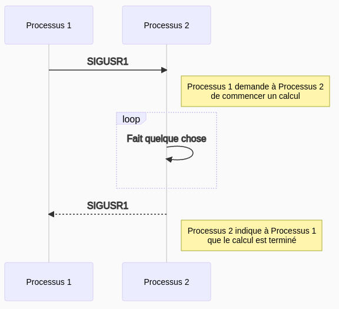

# Communication inter-processus: les signaux
Dylan Robins
2022-01-13

---

Un moyen simple d'établir une communication entre deux processus est d'envoyer des **signaux** via le système d'exploitation.

Exemple avec deux processus:


---

Il existe plein de signaux différents:
- **`SIGINT`: interruption terminal**
- **`SIGKILL`: terminaison impérative. Ne peut être ignoré ou intercepter**
- **`SIGSTOP`: interrompre l’exécution. Ne peut être ignoré ou intercepter**
- **`SIGUSR1`: signal utilisateur 1**
- **`SIGUSR2`: signal utilisateur 2**
- `SIGABRT`: terminaison anormale du processus.
- `SIGILL`: instruction illégale
- `SIGPIPE`: écriture dans un conduit sans lecteur disponible
- `SIGQUIT`: signal quitter du terminal
- `SIGSEGV`: accès mémoire invalide
- `SIGTERM`: signal ’terminer’ du terminal
- etc...

---

Quand un programme reçoit un signal, il est géré par une fonction dite "handler". Tous les signaux ont un handler par défaut (en général, `SIGDFL` = terminaison immédiate du programme);

On peut définir son propre handler à l'aide de la fonction `void signal(int sig, func)`:

```c
#include <stdio.h>
#include <signal.h>

void handler(int signal_number) {
  printf("I received signal %d!\n", signal_number);
}

int main() {
  signal(SIGUSR1, handler);
  pause(); // wait to receive a signal
  return 0;
}
```

---

Pour envoyer un signal, on utilise la fonction `void kill(pid_t dest_pid, int signal_number)`. Pourquoi cette fonction s'appelle kill? A l'origine les signaux servaient uniquement à tuer les processus, mais au fil du temps on s'en est servi pour autre chose.


```c
#include <stdio.h>
#include <signal.h>

int main() {
  int pid;
  // Read a process pid
  printf("Enter the pid of the process to poke: ");
  scanf("%d", &pid);
  // send SIGUSR1 to that pid
  kill(pid, SIGUSR1);
  return 0;
}
```